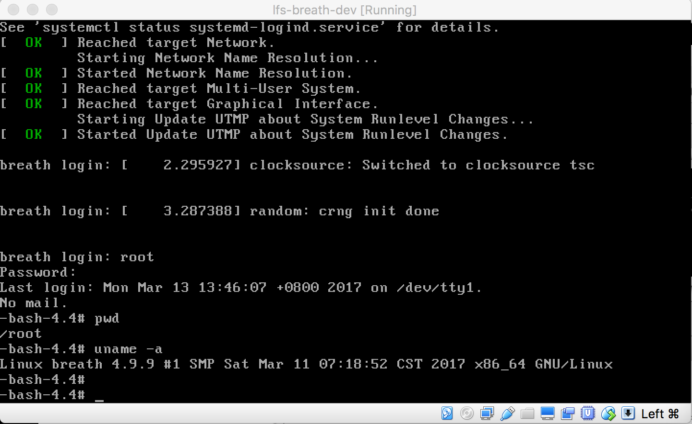
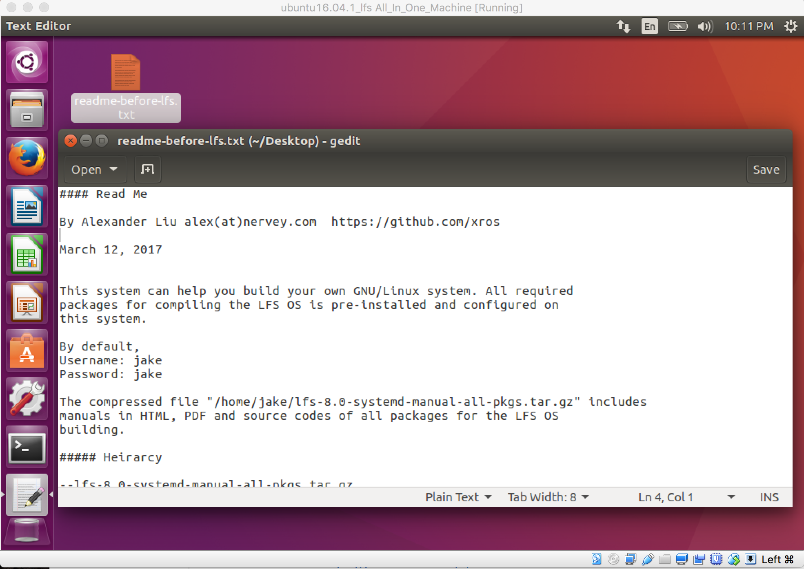

Breath OS
==========
By Alexander Liu

The Breath OS is a new GNU/Linux OS built from source codes. It isn't like any other Linux destros because you have 100% control over it.

The Breath OS is still under development before releasing. But here I would like to share that how I made Breath OS step by step.

How was Breath OS built?
------------------------

Breath OS is created from a basic tutorial of [LFS 8.0 with Systemd](https://www.linuxfromscratch.org).

But the linuxfromscratch.org doesn't provide a live CD for building LFS anymore after LFS version 6.2 . So I created a new environment for building LFS. You can download my [environment](https://github.com/xros/Breath_OS#1-my-whole-environment-for-building-the-a-new-os) and build your system from source codes. It comes along with everything you need for LFS. You can even build the OS without Internet.

Downloads
---------

#### 1. My whole environment for building the a new OS

I created a Virtual Machine based on Ubuntu16.04 64bit. And I installed all required packages for building LFS. In the Virtual Machine, I attached all `LFS-8.0-systemd-manual-all-pkgs.tar.gz` and I wrote a tutorial inside of the Virtual Machine. You can use Virtualbox to import it.

File name: `Ubuntu-16.04.1-64bit-LFS-8.0-Systemd-By-A.Liu.tar.gz`

[Download link](https://mega.nz/#!4GZzgCgD!j9OXlWSJ9-gZakeFpVFKG9Z2wUceDp_7JZhMHzGgYlc)

[Download link (mirror)](https://pan.baidu.com/s/1geGwP1L) Password: x289 

sha256sum: 5267abeb7e5429d28a6ab0561ae8a802ff78c9c51d9461f70e19c1bdaf26d624

Default username: jake

Default password: jake

#### 2. LFS-8.0-systemd-manual-all-pkgs.tar.gz
This includes all source codes of packages which LFS-8.0-systemd needs. And it comes with a PDF/HTML manual for building your LFS system!
    Already included in file `Ubuntu-16.04.1-64bit-LFS-8.0-Systemd-By-A.Liu.tar.gz`

Download link: https://pan.baidu.com/s/1pLRRYuJ

Password: 76q5 

sha256sum: 8773be4ae6a422dde9901faee341eb86118d8dc7b47d20b497358b98d286c94c

If you can read Chinese, you can visit [here](http://www.cnblogs.com/spaceship9/p/6526887.html) to read some of my experiences about building a new OS.

#### 3. LFS-8.0-systemd-tools-compiled.tar.gz

This includes all the tools compiled for building the new OS.
    Already included in file `Ubuntu-16.04.1-64bit-LFS-8.0-Systemd-By-A.Liu.tar.gz`

Note: The tools are only for building the OS and they are the base for building a new OS. But it could be deleted after the new OS was built. Compiling all the tools can be very time consuming, you can start from here if you want to save some time.

Download link: https://pan.baidu.com/s/1o8ns9nG

Password: fbmr

sha256sum: 69e395443f4a46cd863940b905949138ed78928ddb94f364e647f9be27fca18f
